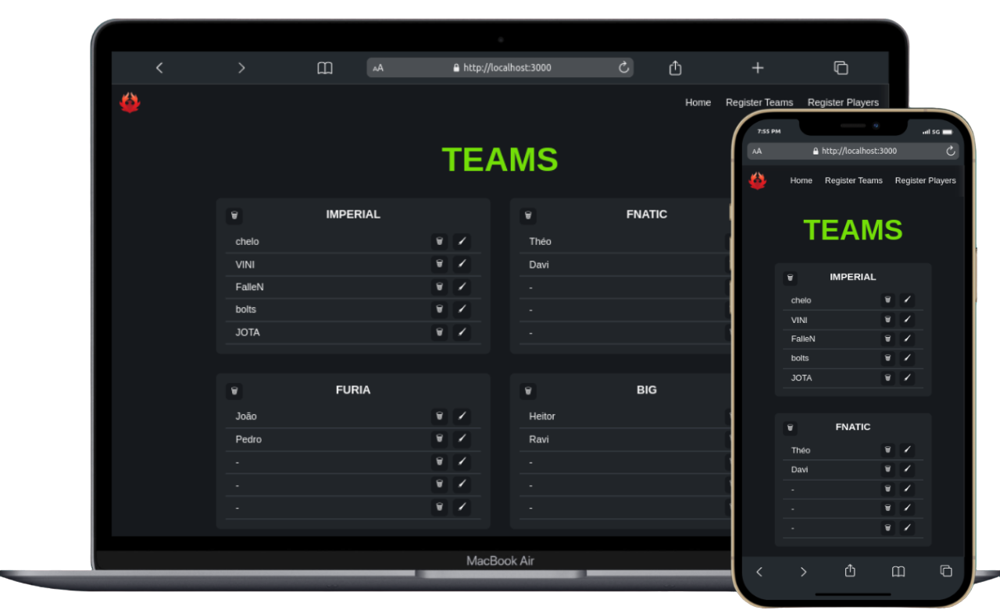

# 🚀💼 Challenge-NDMadvogados-Full-Stack 💼🚀

## Preview:

	

## Step by step for you to run the project:

1. `git clone git@github.com:MateusHoffman/Challenge-NDMadvogados-Full-Stack.git`
2. `cd Challenge-NDMadvogados-Full-Stack`
3. `cd server`
4. `npm install`
5. `Edit the .env variables as per your needs`
6. `docker-compose up -d`
7. `npm run dbreset`
8. `Enter the password you put in the .env POSTGRES_PASSWORD`
9. `npm run dev`
10. `cd ..`
11. `cd client`
12. `npm install`
13. `npm run start`
14. `Open the project at the URL the terminal gave you`

## Connect with me:

	  
	
	

